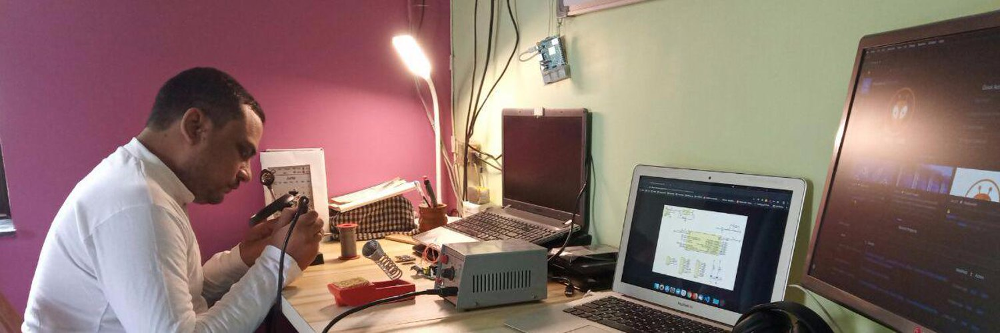

 

## Namaste there 👋, I'm Kunal Gautam.

Born and educated in India, I'm very passionate about Technology. My area of interest is User Experience, Education, Meteorology, Electronics and Wireless Communications.

With over 10 Years of experience in developing Websites, I have learnt a lot about good user experience.  I'm right now freelancing under the name of [AbhashTech](https://abhashtech.com).

I'm a supporter of using quality education available to everyone. According to me, education should be available to everyone at an affordable cost. As of now I'm planning and working to provide quality content for education by analysing cost-effectiveness in providing final content to the students. Currently, I'm learning a lot about using microcontroller, frameworks and algorithms to provide quality content.

Feel free to contact me at:

- [Twitter](http://twitter.com/KunalGautam)
- [Website](https://ikunal.in)
- [AbhashTech Github](https://github.com/AbhashTech/)
